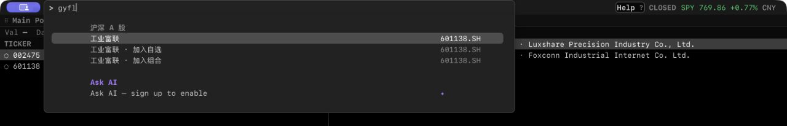
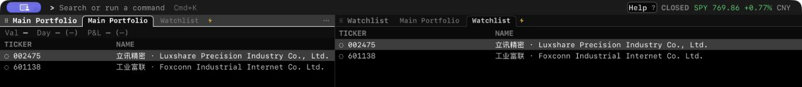
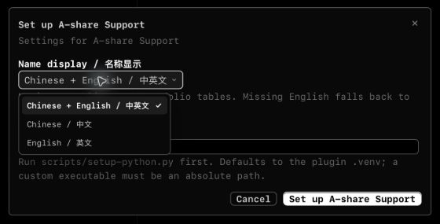

# Gloomberb A 股支持

[English](README.md)

**当前为 Alpha 公开测试版。** 插件在原生界面中提供沪深公司搜索和中英文名称。它是独立社区插件，不修改已安装的官方客户端。

## 功能

| 功能 | 行为 |
|---|---|
| 全局搜索 | 支持中文名、全拼、拼音首字母和代码。选定后核对发行人，再打开原生研究。歧义保留多个候选。 |
| 原生添加入口 | 预填原生“加入自选／加入组合”流程，仍需原生确认。 |
| 原生表格名称 | 沪深普通股可显示“中文 · English”、仅中文或仅英文。缺英文时显示已核对的中文。 |
| 数据保护 | 保留证券键、交易所、币种、持仓、分组和无关字段。没有来源依据的自定义名称保留。 |

中文名称来自 CNINFO 当前发行人核对。英文来自同证券的原生 Cloud／Yahoo 报价或准确代码搜索。插件核对代码、交易所、CNY 和普通股类型，不翻译名称。

## 界面截图

以下图片裁剪自 **2026-10-05** 的实际 Gloomberb 0.15.8 macOS 应用。使用临时演示配置，持仓为虚构示例。

### 用首字母搜索



在全局搜索中输入 `gyfl`，找到工业富联，再选择原生研究、加入自选或加入组合。

### 原生列表中的名称



原生 Watchlist 和 Main Portfolio 在 NAME 列显示“中文 · English”，TICKER 列保留证券代码。演示表格只显示这两列。图中的宽桌面布局可显示完整名称；窄布局仍会截断，终端 NAME 默认宽度为 16 个显示单元。

### 名称显示设置



在 `PL → A-share Support → Setup` 中选择中英文、仅中文或仅英文。缺少英文时显示已核对的中文。

## 安装

需要 Gloomberb 0.15.8 或以上、Python 3.10 或以上，以及 Python 的 `venv` 和 `pip`。实际宿主验收基线为 0.15.8。

1. 使用官方安装命令：

   ```sh
   gloomberb install babyjiang7/gloomberb-ashare
   ```

2. 运行 `gloomberb plugins`，查看插件目录。标准 macOS 配置下运行：

   ```sh
   python3 ~/.gloomberb/plugins/gloomberb-ashare/scripts/setup-python.py
   python3 ~/.gloomberb/plugins/gloomberb-ashare/scripts/setup-python.py --check
   ```

   Windows 使用 `py -3` 和实际脚本路径。Linux 或自定义 `GLOOMBERB_HOME` 使用列表中显示的目录。脚本只在插件 `.venv` 内安装锁定的 `pypinyin`，不安装或升级 Python。`--check` 不联网、不安装依赖。

3. 重启 Gloomberb。在 `PL` 中选择 **A-share Support**。如处于停用状态，启用它。打开 **Setup**，选择 `Name display / 名称显示`。
4. 运行 `gloomberb plugin doctor gloomberb-ashare` 检查插件。

官方安装器不会自动安装 Python 依赖。首次使用前必须运行设置脚本。当前插件从 GitHub 安装，尚未收录官方 Available 目录。未收录插件的安装和更新跟随仓库默认分支。不要同时安装另一份 ID 为 `ashare-local` 的已链接插件。

## 使用

1. 桌面打开 `Cmd+K`，终端打开 `Ctrl+P`。
2. 输入 `工业富联`、`gongyefulian`、`gyfl` 或 `601138`。
3. 选择公司，进入原生研究；或选择原生添加动作。
4. 在插件 Setup 中切换名称模式。默认使用中英文同时显示。

## 已知限制

- 原生 NAME 是单行。窄布局会截断长名称，终端默认宽度为 16 个显示单元。
- Portfolio Grid 标签仍显示代码。共享名称字段也可能影响使用该字段的其他原生视图。
- 即时界面名称同步依赖可见的原生状态栏。
- Watchlist／Portfolio 面板内的输入框仍使用原生解析器，不直接支持中文／拼音。
- 上游可用性和全市场英文名称覆盖没有保证。目录结果只是候选，选定后仍需核对。
- 本版适配沪深普通股，暂不适配北交所、基金、债券和海外证券。
- 本版没有替代报价源、自动财报补缺、独立研究面板或 PDF 服务。原生 LAST／CHG%／AGE 的报价问题仍由宿主及提供商处理。
- macOS 桌面是主要验收平台。Windows／Linux 端到端行为仍属实验范围，具体检查见[验收说明](docs/validation.md)。

## 更新和卸载

1. 用 `gloomberb update gloomberb-ashare` 更新，然后重启。按发布说明要求重新运行 Python 设置／检查。
2. 在 `PL` 中停用插件，停止注册项、待处理任务和插件拥有的 Python 子进程。
3. 在 `PL` 中移除，或运行 `gloomberb remove gloomberb-ashare`。

停用或卸载后，已保存名称、来源记录和 NAME 列设置保留。插件不会自动恢复旧名称或删除证券。持仓和分组继续由 Gloomberb 管理。

代码使用 [MIT 许可证](LICENSE)。提供商数据不受插件的 MIT 许可证授权。请勿在公开反馈中提交个人持仓、凭据或本地日志。完整开发步骤见[英文文档](README.md)。
